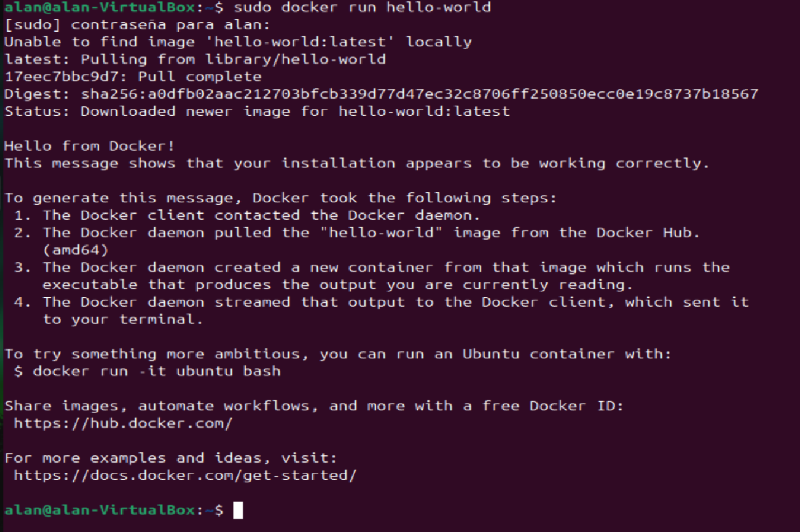
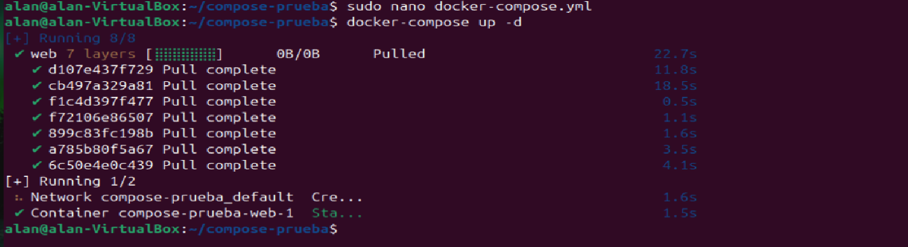
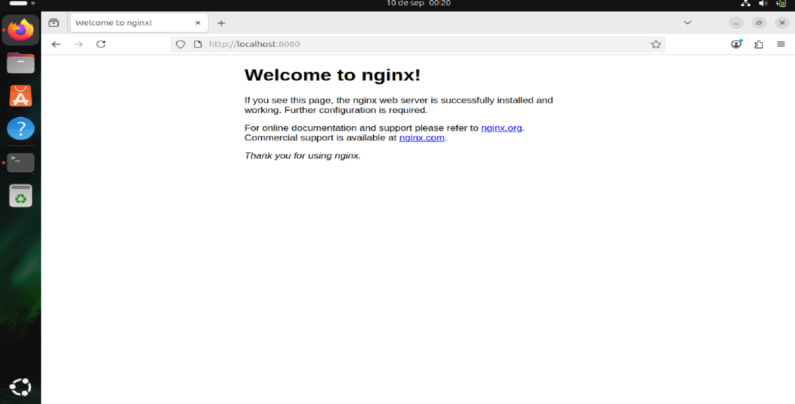

</img>

<h2 style="text-align: center;">Licenciatura en Ingenería en

Tecnologías de la Información y Comunicación Área Redes Inteligentes y Ciberseguridad</h2>

<h3 style="text-align: center;">Automatización de Infraestructura Digital I</h3>
<h3 style="text-align: center;">Global</h3>


<br>**Tema:** Instrumento de evaluación Global
<br>**Docente:** Eric Domenzain Morales
<br>**Nombre del alumno:** Alan Francisco Emmanuel Aguilar Fuentes
<br>**Número de control:** 1222100503
<br>**Grupo:** GIRI5091
<br>

<p style="text-align: right;">Dolores Hidalgo Cuna de la Independencia Nacional, Guanajuato a Martes 04 de Noviembre del 2025.

# Índice

- [Introducción](#introducción)
- [Desarrollo](#desarrollo)
  - [Descripción de las herramientas utilizadas para automatización](#descripción-de-las-herramientas-utilizadas-para-automatización)
    - [Docker Engine](#docker-engine)
    - [Docker Compose](#docker-compose)
    - [Docker y Swagger (OpenAPI)](#docker-y-swagger-openapi)
  - [Procedimiento de instalación](#procedimiento-de-instalación)
    - [Instalación técnica de herramientas](#instalación-técnica-de-herramientas)
      - [Visual Studio Code](#visual-studio-code)
      - [Plugins y extensiones de Visual Studio Code](#plugins-y-extensiones-de-visual-studio-code)
    - [Instalación técnica de Docker en Ubuntu](#instalación-técnica-de-docker-en-ubuntu)
    - [Instalación técnica de Git](#instalación-técnica-de-git)
- [Evidencia de pruebas de verificación](#evidencia-de-pruebas-de-verificación)
  - [Imagen "hello-world"](#imagen-hello-world)
  - [Ejecución de un archivo yml](#ejecución-de-un-archivo-yml)
- [Conclusión](#conclusión)
- [Bibliografía](#bibliografía)


# Introducción

En los proyectos de desarrollo de software, la correcta configuración de los entornos de trabajo es un punto clave para asegurar la calidad y rapidez en la entrega de resultados. La integración de herramientas modernas ha transformado los flujos de trabajo, brindando a los equipos mayor control, organización y eficiencia en cada una de las etapas del desarrollo. En este apartado se busca ofrecer una guía práctica que permita comprender y aplicar estas configuraciones de manera sencilla y ordenada. Uno de los principales avances lo representan Docker y Docker Compose, tecnologías que han revolucionado la forma en que se construyen y despliegan aplicaciones. Gracias a los contenedores, es posible encapsular dependencias, servicios y configuraciones en entornos ligeros, replicables y fáciles de administrar. Esto reduce considerablemente los problemas de compatibilidad, a la vez que facilita la colaboración entre equipos de trabajo que comparten un mismo proyecto.
De manera complementaria, el uso de Visual Studio Code como editor de código y Git como sistema de control de versiones, añade un soporte esencial para mantener un desarrollo organizado y con buenas prácticas. A estas herramientas se suma Swagger, una utilidad que mejora la documentación de APIs y permite validar de forma visual su correcto funcionamiento. El objetivo general de este documento es servir como guía para la instalación, configuración y uso básico de estas tecnologías en un sistema operativo basado en Linux, específicamente Ubuntu, consolidando una base sólida para implementar un entorno de desarrollo moderno, automatizado y orientado a resultados.


# Desarrollo
## Descripción de las herramientas utilizadas para automatización

### Docker Engine

Docker Engine es el principal componente de Docker. Es un motor cliente-servidor que se encarga de crear y ejecutar contenedores. El cual esta compuesto por:

- **Docker Daemon (`dockerd`)**: ejecuta y gestiona contenedores.
- **API REST**: permite la comunicación entre herramientas y el daemon.
- **Cliente Docker (`docker`)**: interfaz de línea de comandos para interactuar con el daemon.

Permite aislar aplicaciones y sus dependencias en contenedores portables, ligeros y reproducibles.

---

### Docker Compose

Docker Compose es una herramienta la cual simplifica el manejo de aplicaciones con múltiples contenedores. Es usada para lo siguiente:

- Declarar servicios, redes y volúmenes en un solo archivo (`docker-compose.yml`).
- Ejecutar todo el entorno con `docker compose up`.
- Facilitar entornos de desarrollo, pruebas y despliegue.

---

### Docker y Swagger (OpenAPI)

Swagger (ahora parte del estándar OpenAPI) es una herramienta para describir y documentar APIs REST. Aunque **Docker Swagger** no es una herramienta oficial, se refiere a:

- Contenerizar aplicaciones con documentación Swagger.
- Usar contenedores para desplegar herramientas como `Swagger UI`, `Swagger Editor` o `Swagger Codegen`.
- Permite acceder y probar APIs desde una interfaz gráfica web dentro de un contenedor.

## Procedimiento de instalación

### Instalación técnica de herramientas

- **Visual Studio Code**

Visual Studio Code es una herramienta que tiene soporte nativo para gran variedad de lenguajes, entre ellos podemos destacar los principales del desarrollo Web: HTML, CSS, y JavaScript, entre otros.

Para su instalación, podemos seguir los siguientes pasos:

1. Link del sitio oficial de descarga de Visual Studio Code: https://code.visualstudio.com/

2. Seleccionar el sistema operativo dependiendo del programa.

3. Descargar el programa correspondiente e instalarlo en el equipo.


- **Plugins y extensiones de Visual Studio Code**

Al tener instalado Visual Studio Code en nuestro equipo, podremos potenciar su eficacia y aumentar nuestra productividad al instalar extensiones dependiendo el trabajo a realizar. Para la instalación de extensiones, podemos seguir los siguientes pasos para instalar extensiones en Visual Studio Code:

1. Dentro de Visual Studio Code, nos dirigimos al apartado de Extensiones

2. Buscamos las extensiones que podrían servirnos, por ejemplo: **extensiones para Python, HTML, Docker, Git, etc.**

## Instalación técnica de Docker en Ubuntu

Para seguir con la instalación de Docker en un sistema operativo Ubuntu, seguimos el siguiente tutorial: https://docs.docker.com/engine/install/ubuntu/

A continuación, estos son los pasos listados para la instalación usando los repositorios apt:

1. Agregamos los repositorios a nuestro sistema:

```bash
# Add Docker's official GPG key:
sudo apt-get update
sudo apt-get install ca-certificates curl
sudo install -m 0755 -d /etc/apt/keyrings
sudo curl -fsSL https://download.docker.com/linux/ubuntu/gpg -o /etc/apt/keyrings/docker.asc
sudo chmod a+r /etc/apt/keyrings/docker.asc

# Add the repository to Apt sources:
echo \
  "deb [arch=$(dpkg --print-architecture) signed-by=/etc/apt/keyrings/docker.asc] https://download.docker.com/linux/ubuntu \
  $(. /etc/os-release && echo "${UBUNTU_CODENAME:-$VERSION_CODENAME}") stable" | \
  sudo tee /etc/apt/sources.list.d/docker.list > /dev/null
sudo apt-get update
```

2. Instalamos la aplicación de Docker Engine:

```bash
sudo apt-get install docker-ce docker-ce-cli containerd.io docker-buildx-plugin docker-compose-plugin
```

Después de la instalación, es recomendable realizar las acciones Post-Installation de Docker, donde podremos usar Docker sin el comando **sudo**. La página a continuación contiene los pasos descritos: https://docs.docker.com/engine/install/linux-postinstall/.

1. Crea el grupo "docker"

```bash
sudo groupadd docker
```

2. Agrega tu usuario al grupo "docker"

```bash
sudo usermod -aG docker $USER
```

3. Cierra y vuelve a iniciar sesión para aplicar cambios, o pon el siguiente comando:

```bash
newgrp docker
```

4. Verifica que puedas usar los comandos sin usar "sudo"

```bash
docker run hello-world
```

## Instalación técnica de Git

Para descargar Git de forma local, podemos seguir los mismos pasos que se usaron para descargar Visual Studio Code en la parte anterior. Por lo tanto, los pasos son algo similares:

1. Ir al sitio oficial de descargas de Git en el siguiente enlace: https://git-scm.com/downloads

2. Selecciona el programa dependiendo de tu sistema operativo.

3. Instala el programa en tu equipo local.

4. Durante la instalación, puedes dejar la mayoría de las opciones por defecto. Asegúrate de seleccionar "Git from the command line and also from 3rd-party software" si quieres usar Git desde PowerShell o CMD.

5. Después de instalado, puedes verificar la instalación con el comando:

```bash
git --version
```

6. Realiza las siguientes configuraciones de comandos para el correcto funcionamiento de Git y su conexión con GitHub, así enlazarás tu usuario con los repositorios locales y en la nube.

```bash
git config --global user.name "Tu Nombre"
git config --global user.email "tu_correo@mailto.com"
```

**Nota:** Para sistemas operativos Linux, Git ya viene instalado por defecto, por lo cual si cuentas ya con un sistema operativo Linux, puedes ejecutar directamente **git --version**. Sin embargo, si está desactualizada la versión, puedes actualizar Git en tu sistema operativo con los siguientes comandos:

1. En distribuciones como Ubuntu, Debian, Mint y basados en apt:

```bash
sudo add-apt-repository ppa:git-core/ppa -y
sudo apt update
sudo apt install git -y
```

2. En Fedora y distribuciones en dnf:
```bash
sudo dnf install git -y
```

3. En distribuciones con paqueterías yum:

```bash
sudo yum remove git
sudo yum install https://repo.ius.io/ius-release-el$(rpm -E %{rhel}).rpm -y
sudo yum install git236 -y
```

4. Para distribuciones como Arch, Manjaro y basados en pacman:
```bash
sudo pacman -Syu git
```

## Evidencia de pruebas de verificación

### Imagen "hello-world"


### Ejecución de un archivo yml




## Conclusión

El uso combinado de Docker Engine, Docker Compose y Swagger se ha consolidado como una estrategia efectiva para optimizar los entornos de desarrollo, aportando flexibilidad y control en cada etapa del proceso. Estas herramientas permiten levantar aplicaciones en contenedores reproducibles, gestionar múltiples servicios de forma coordinada y disponer de documentación clara para las APIs, lo que en conjunto favorece la integración, el trabajo en equipo y la reducción de errores comunes. Al integrar también utilidades como Visual Studio Code y Git, el flujo de trabajo se vuelve más completo, ya que no solo se asegura la correcta escritura y organización del código, sino que también se garantiza un historial confiable de cambios y una mayor facilidad para la colaboración entre desarrolladores. Las pruebas realizadas desde la ejecución del contenedor `hello-world` hasta la validación de archivos `docker-compose.yml` confirman que el entorno está correctamente configurado y listo para soportar proyectos modernos. En definitiva, este conjunto de herramientas ofrece una infraestructura sólida y alineada con las prácticas DevOps, promoviendo la eficiencia, la escalabilidad y la calidad en el desarrollo de software, lo que constituye una ventaja significativa frente a los retos actuales de la industria tecnológica.

## Bibliografía

1. «Ubuntu». (2025, 28 agosto). Docker Documentation. https://docs.docker.com/engine/install/ubuntu/
2. «Post-installation steps». (2025, 15 julio). Docker Documentation. https://docs.docker.com/engine/install/linux-postinstall/
3. ¿Qué es Docker y Docker-Compose? (2024, 15 febrero). Blog HostingTG. https://www.hostingtg.com/blog/que-es-docker-y-docker-compose/
4. Visual Studio Code - Code editing. Redefined. (2021, 3 noviembre). https://code.visualstudio.com/
5. Comenzar con GitHub Desktop - Documentación de GitHub. (s. f.). GitHub Docs. https://docs.github.com/es/desktop/overview/getting-started-with-github-desktop
6. Swagger docker – TomoNota. (s. f.). https://tomonota.net/swagger-docker/
# Recuperaci-n-Global-AID1-AFEAF
